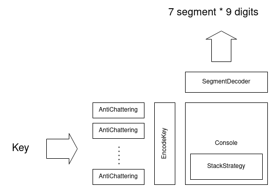

# rpn_engine
Reverse Polish Notation engine for a pocket calculator
## Description
A collection of the Classes/Functions for an RPN Calculator. Following classes/functions are provided : 
- AntiChattering  class: Kill the chattering on physical key. 
- Console class : UIF center of a calculator. It support editing and displaying.
- EncodeKey() : Convert the position in key matrix to the command. 
- SegmentDecoder class : Convert the digit character to the segment pattern. 
- StackStrategy class : Stack machine template. 

To obtain the reference manual, run doxygen :
```shell
cd doc
doxygen Doxyfile
```

The document is generated in the html sub-directory.
## Structure
This library contains several classes and a function. Each component has its own functionality and behavior. Thus, their usage is fixed from the first. The Following figure depict the signal flow of an electronic calculator based on this library. 



## Environment
This library is tested by following environment 
- Ubuntu 20.04 LTS
- GitHub Actions ubuntu-latest ( GCC 9 )
- GitHub Actions windows-latest ( MSVC 2022 )
- GCov ( with GCC )
- Doxygen

## Install
Run following command :
```shell
mkdir build
cd build
cmake ..
cmake --build . 
```

The library is created in the build/src directory. You can run test program by :
```shell
ctest
```

## License
This project is shared with the [MIT License](LICENSE). 